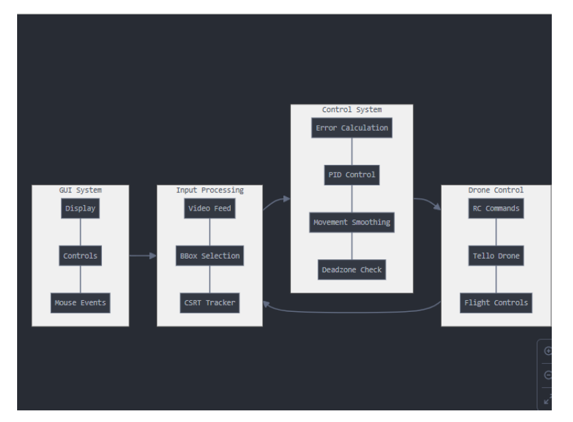
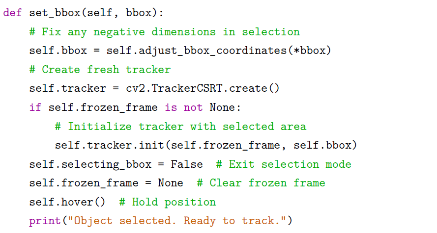
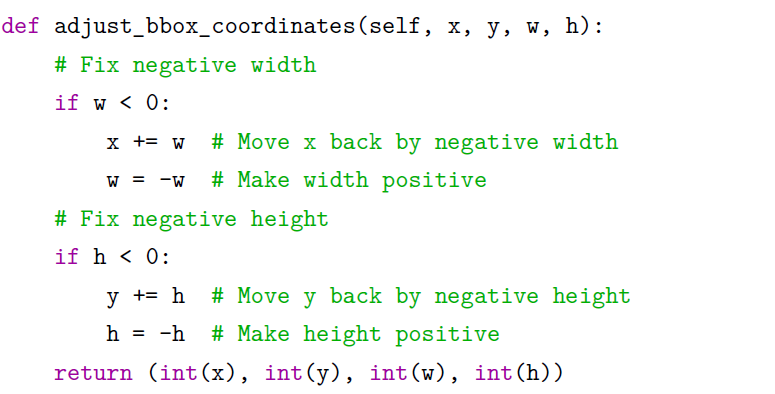

# drone-object-tracking
Real-time object tracking drone system using computer vision and PID control with DJI Tello.
## Drone Object Tracking System

This project presents a real-time object tracking system using a DJI Tello drone.  
The system detects and tracks a user-selected object and adjusts the drone’s movement accordingly.

---

### Overview

The drone captures a live video stream, where the user selects an object via a graphical interface.  
The selected object is tracked in real time using computer vision, and control signals are generated to follow it.

---

### My Work

- Development of real-time object tracking using OpenCV (CSRT)
- Implementation of drone control via Python (djitellopy)
- Design of a GUI for object selection and control
- Implementation of control logic for movement adjustment
- Testing and optimization of tracking behavior

---

### System Architecture

The system consists of:
- GUI for user interaction and object selection
- Image processing for tracking
- Control system for movement calculation
- Communication with the drone via RC commands

---

### Tracking System (GUI)

- Object selection via mouse interaction  
- Real-time tracking with bounding box  
- Feedback values for control (error, commands, status)  

---

### Control Logic

The system calculates the position error between the tracked object and the image center.  
This error is used to generate control commands for drone movement.

- Error-based control approach  
- Movement smoothing for stability  
- Forward/backward adjustment based on object size  

---

### Code Highlights

Object tracking initialization:

Bounding box correction logic:

---

### Technologies

- Python  
- OpenCV  
- djitellopy  
- PyQt (GUI)

---

### Features

- Real-time object tracking  
- Manual object selection  
- Autonomous drone movement  
- Visual feedback and control status  

---

### Note

This project demonstrates the integration of computer vision and real-time control in a practical application using a low-cost drone platform.
